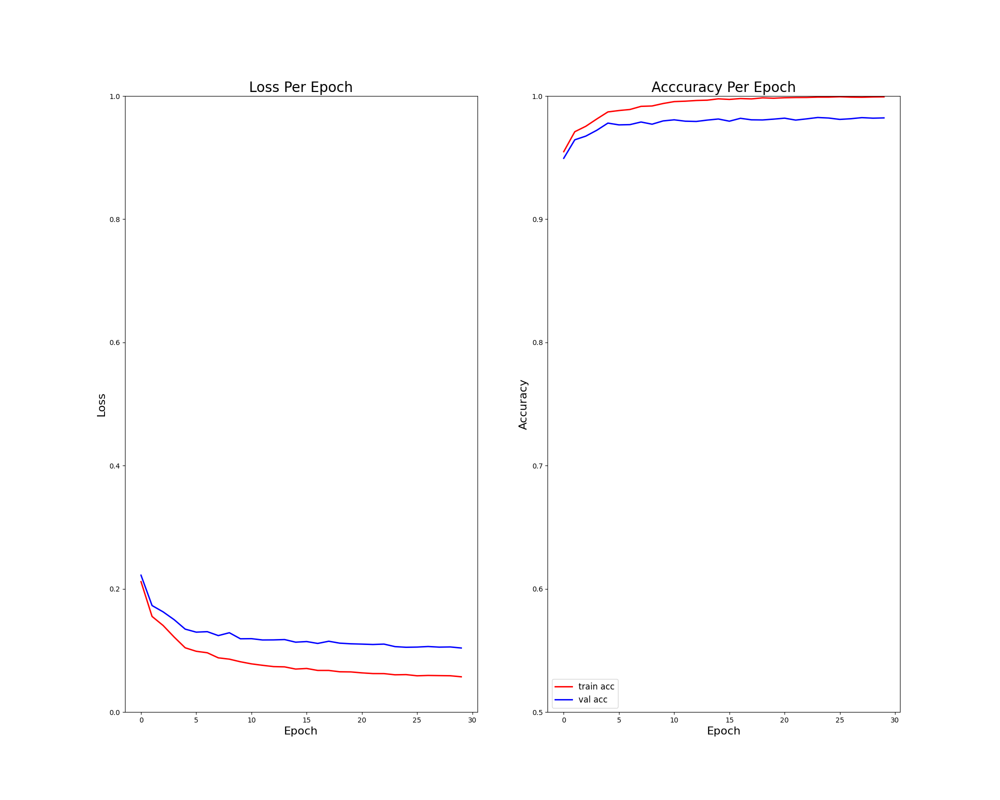

# Handin 2

| Name                 | Student ID |
| -------------------- | ---------- |
| Daniel Naddaf        | 202106189  |
| Behzad Haidari       | 202006894  |
| Peter Ernst Lüdeking | 202307043  |


## Part I: Derivative

**Derivation of $\frac{\partial L}{\partial z_i}$**

Given the Negative Log Likelihood loss function:
$$
L(z) = - \sum_{i=1}^k y_i \ln (\textrm{softmax}(z)_i)
$$
where $y$ is a one-hot encoded vector with $y_j=1$ for the true label $j$, and $\textrm{softmax}(z)_i = \frac{e^{z_i}}{\sum_{a=1}^k e^{z_a}}$.

Since $y_j=1$ and all other $y_i=0$ for $i \neq j$, the sum simplifies to:
$$
L(z) = - y_j \ln (\textrm{softmax}(z)_j) = - \ln (\textrm{softmax}(z)_j) = - \ln \left( \frac{e^{z_j}}{\sum_{a=1}^k e^{z_a}} \right)
$$
Using logarithm properties, $\ln(A/B) = \ln(A) - \ln(B)$:
$$
L(z) = - \left( \ln(e^{z_j}) - \ln\left(\sum_{a=1}^k e^{z_a}\right) \right) = - z_j + \ln\left(\sum_{a=1}^k e^{z_a}\right)
$$

Now we need to compute the partial derivative of $L(z)$ with respect to $z_i$.

**Case 1: $i = j$**
$$
\frac{\partial L}{\partial z_j} = \frac{\partial}{\partial z_j} \left( - z_j + \ln\left(\sum_{a=1}^k e^{z_a}\right) \right)
$$
The derivative of $-z_j$ with respect to $z_j$ is $-1$.
For the second term, we use the chain rule: $\frac{\partial}{\partial x} \ln(f(x)) = \frac{f'(x)}{f(x)}$.
Here, $f(z) = \sum_{a=1}^k e^{z_a}$. The derivative of $f(z)$ with respect to $z_j$ is $\frac{\partial}{\partial z_j} (e^{z_j}) = e^{z_j}$, since all other terms $e^{z_a}$ where $a \neq j$ are treated as constants with respect to $z_j$.
So,
$$
\frac{\partial}{\partial z_j} \ln\left(\sum_{a=1}^k e^{z_a}\right) = \frac{e^{z_j}}{\sum_{a=1}^k e^{z_a}} = \textrm{softmax}(z)_j
$$
Combining these, when $i=j$:
$$
\frac{\partial L}{\partial z_j} = -1 + \textrm{softmax}(z)_j
$$

**Case 2: $i \neq j$**
$$
\frac{\partial L}{\partial z_i} = \frac{\partial}{\partial z_i} \left( - z_j + \ln\left(\sum_{a=1}^k e^{z_a}\right) \right)
$$
The term $-z_j$ is a constant with respect to $z_i$ (since $i \neq j$), so its derivative is $0$.
For the second term, similarly, using the chain rule:
$$
\frac{\partial}{\partial z_i} \ln\left(\sum_{a=1}^k e^{z_a}\right) = \frac{\frac{\partial}{\partial z_i} \left(\sum_{a=1}^k e^{z_a}\right)}{\sum_{a=1}^k e^{z_a}}
$$
The derivative of the sum $\sum_{a=1}^k e^{z_a}$ with respect to $z_i$ is $e^{z_i}$, as only the $e^{z_i}$ term depends on $z_i$.
So,
$$
\frac{\partial}{\partial z_i} \ln\left(\sum_{a=1}^k e^{z_a}\right) = \frac{e^{z_i}}{\sum_{a=1}^k e^{z_a}} = \textrm{softmax}(z)_i
$$
Combining these, when $i \neq j$:
$$
\frac{\partial L}{\partial z_i} = 0 + \textrm{softmax}(z)_i = \textrm{softmax}(z)_i
$$

**Combining both cases:**
We can express both cases using the Kronecker delta $\delta_{i,j}$:
$$
\frac{\partial L}{\partial z_i} = - \delta_{i, j} + \textrm{softmax}(z)_i
$$
where $\delta_{i,j} = 1$ if $i=j$ and $0$ otherwise. This matches the desired result.


## Part II: Implementation and test

Our neural network implementation for multi-class classification, including a one-hidden layer architecture with ReLU activation, softmax output, and negative log-likelihood loss with L2 weight decay, was completed in `net_classifier.py`. The model was trained using mini-batch stochastic gradient descent, with validation accuracy used to select the best model parameters.

### Forward Pass Snippet

The forward pass computes the pre-activation values for the hidden layer, applies the ReLU activation, computes the pre-softmax scores for the output layer, and finally applies the softmax function to get class probabilities.

```python
# From NetClassifier.cost_grad or NetClassifier.predict
W1 = params['W1']
b1 = params['b1']
W2 = params['W2']
b2 = params['b2']

# Hidden Layer Computation
z1 = np.dot(X, W1) + b1          # Linear combination
hidden_layer = relu(z1)          # Apply ReLU activation

# Output Layer Computation
scores = np.dot(hidden_layer, W2) + b2 # Linear combination (pre-softmax)
probabilities = softmax(scores)  # Apply softmax to get class probabilities
```

### Backward Pass Snippet

The backward pass computes the gradients for all weights and biases using backpropagation, incorporating the simplified derivative for softmax-cross-entropy and the L2 regularization terms.

```python
# From NetClassifier.cost_grad
# Gradient at output layer: dL/dz = softmax(z) - y (derived in Part I)
dz2 = probabilities - labels  # shape n x output_size

# Gradients for W2 and b2
d_w2 = np.dot(hidden_layer.T, dz2) # shape hidden_size x output_size
d_b2 = np.sum(dz2, axis=0, keepdims=True)  # shape 1 x output_size

# Backpropagate through hidden layer
dhidden = np.dot(dz2, W2.T)  # shape n x hidden_size

# Backpropagate through ReLU (derivative is 1 for positive, 0 otherwise)
dz1 = dhidden * (z1 > 0)  # shape n x hidden_size

# Gradients for W1 and b1
d_w1 = np.dot(X.T, dz1) # shape input_size x hidden_size
d_b1 = np.sum(dz1, axis=0, keepdims=True)  # shape 1 x hidden_size

# Average gradients over the batch
n = X.shape[0]
d_w1 /= n
d_w2 /= n
d_b1 /= n
d_b2 /= n

# Add weight decay gradients (derivative of c*W^2 is 2*c*W)
d_w1 += 2 * c * W1
d_w2 += 2 * c * W2
```

### Implementation Details and Challenges

The implementation proceeded smoothly after carefully deriving the combined derivative of the negative log-likelihood and softmax function. The gradient checker (`numerical_grad_check`) provided valuable verification during development, confirming the correctness of the backpropagation implementation. No significant issues or failures were encountered during the testing phase after incorporating the suggested adjustments.

### Training and Validation Plots

The following plots illustrate the training and validation loss and accuracy over 30 epochs, generated by running `net_test.py`.



**Comments on the Plots:**

*   **Loss Per Epoch:**
    *   Both training loss (red) and validation loss (blue) decrease rapidly in the initial epochs, indicating that the model is learning effectively.
    *   The training loss continues to decrease and flatten out over 30 epochs, reaching a very low value.
    *   The validation loss also decreases significantly, but it appears to flatten out earlier than the training loss and remains consistently higher than the training loss throughout the latter half of the training process. This gap between training and validation loss suggests that the model might be starting to **overfit** to the training data. While validation loss is still decreasing slowly, the large difference indicates reduced generalization ability beyond the training set.

*   **Accuracy Per Epoch:**
    *   Both training accuracy (red) and validation accuracy (blue) increase sharply at the beginning of training, demonstrating successful learning.
    *   Training accuracy reaches very high levels, approaching 1.0 (or 100%), and continues to improve slightly towards the end.
    *   Validation accuracy also shows strong improvement, plateauing around 0.98 (98%) accuracy.
    *   Similar to the loss plot, a noticeable gap exists between training accuracy and validation accuracy, with training accuracy being consistently higher. This further supports the observation of overfitting, as the model performs better on data it has seen during training compared to unseen validation data.
    *   Despite the overfitting indicated by the gap, the validation accuracy reaching around 98% is a good result for MNIST.