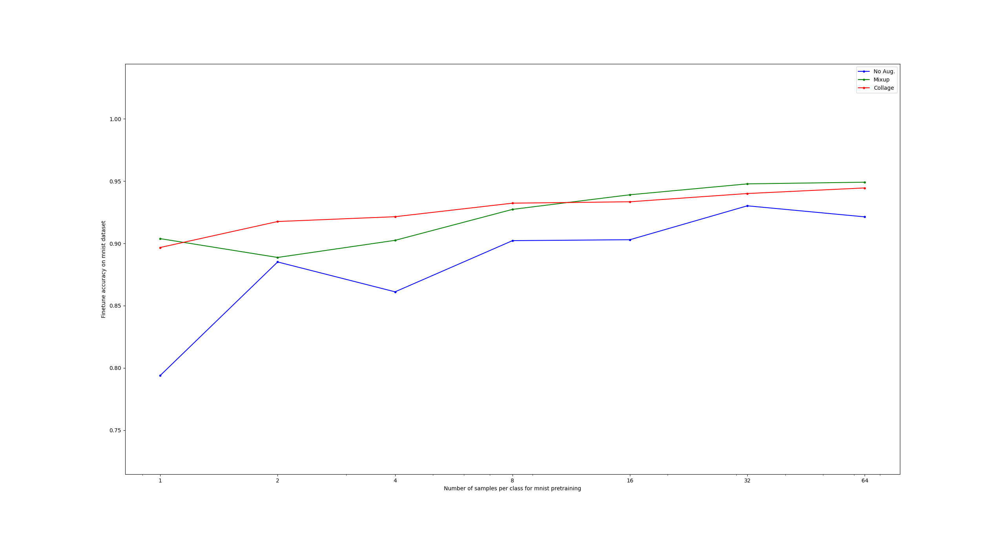
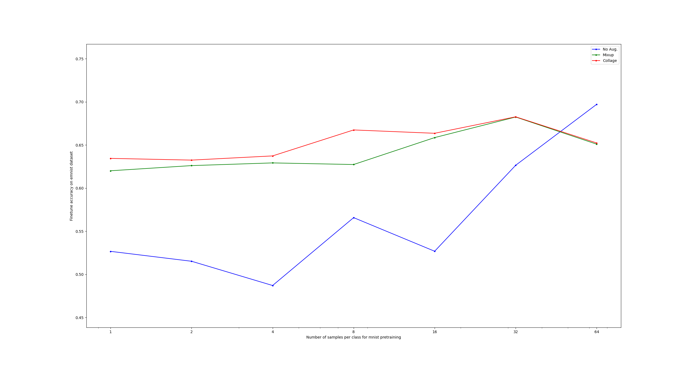
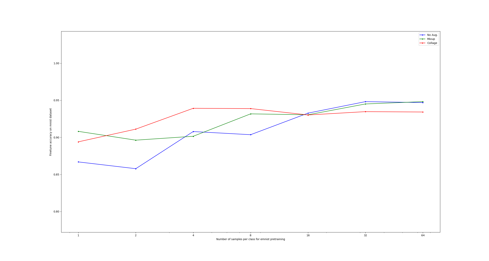
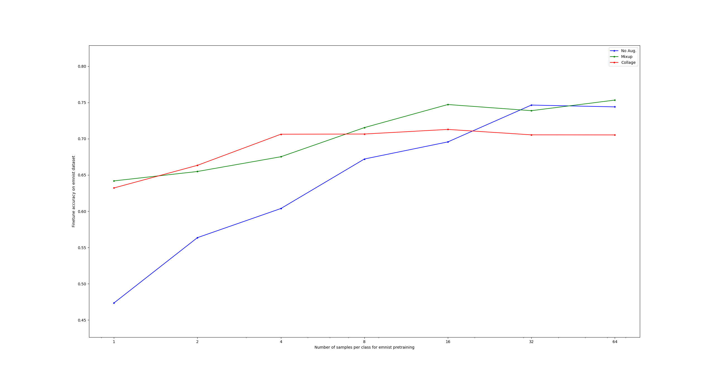

# Handin 3

| Name                 | Student ID |
| -------------------- | ---------- |
| Daniel Naddaf        | 202106189  |
| Peter Ernst Lüdeking | 202307043  |

# Short answers:

You are requested to provide (short) answers to the following questions to ensure that you understand how the code is working:

- **Where are we ensuring that the finetuning does not affect the feature extractor?**
    - The feature extractor uses `network.parameters()` while the finetuning optimizer uses `network.generalizer.parameters()`, thus updating parameters independently of each other.

- **How does the code work that gets $s$ samples per class for the pre-training dataset?**
    - `get_subsampled_dataset` creates a subsample of `k` random datapoints from each class, and concatenates them into a single subsample, representative of all classes.

- **What is the `forward_call` parameter responsible for in the `train()` method (located in `network_training.py`)?**
    - The parameter is used to define which function of the network to use for the forward pass, when training.

- **Describe how the `augment()` method works (located in `augmentations.py`).**
    - We start by preparing arrays: `new_batch` to store augmented images, `merge_indices` to track which images were combined, and `interpolations` to store mixing ratios. We then loop through the batch, and in this loop we randomly pick another image to merge with (which is stored in `merge_indices`), apply the augmentation function to combine the two images, then save the augmented image to `new_batch` and the interpolation values to `interpolations`. After the loop, we convert the augmented images to tensors, compute new labels, and return the new labels and augmented images.

- **If we pre-train and finetune on the same dataset, is there any reason to do the finetuning step?**
    - Not really, since the network has already learned the features and classification bounds for the dataset. Finetuning would repeat most of the training already done. Finetuning would be best used if you had different datasets for finetuning (e.g. augmented data).

# Predictions (before running experiments):

- **Will the collage and mixup data augmentations help achieve higher finetune accuracies? Which do you expect will be more effective?**
    - Yes. Augmenting the data gives us more data to train on, which would yield a better model. We expect the collage data augmentation to be more effective, as the features are more pronounced.

- **What relationship do you expect between the number of samples in the pre-training dataset and the finetuning accuracy? Does this change with data augmentations?**
    - We expect more pre-training samples to lead to higher finetuning accuracy, as the feature extractor learns more detailed representations. With data augmentations, we expect this relationship to still hold.

# Experimental Results

## 1. Pre-train: MNIST → Finetune: MNIST

**Observations:**
- *Accuracy vs. samples per class:* The accuracy increases with the number of samples per class, no matter if we are uisng augmentations or not.
- *Effect of augmentations:* Both types of augmentations increases the accuracy.

---

## 2. Pre-train: MNIST → Finetune: EMNIST

**Observations:**
- *Accuracy vs. samples per class:* The accuracy increases with the number of samples per class, but the curves differ for augmentations vs no augmentation. The augmentation curves increase slightly at a much lower pace, while the case of no augmentation starts with a very low accuracy and blows up after 16 samples per class. For some reason, the augmented datasets end up with a slightly reduced accuracy at 64 samples per class.
- *Effect of augmentations:* Using augmentation immediatly gives us a higher accuracy, which is stable longer. While the non-augmented dataset starts low and rises as more samples are introduced. One takeaway from this, is that one could get a much better accuracy with a small dataset, by introducing augmented samples.

---

## 3. Pre-train: EMNIST → Finetune: MNIST

**Observations:**
- *Accuracy vs. samples per class:* As in the other cases, the accuracy increases with the number of samples per class.
- *Effect of augmentations:* In this case, augmenting the data does not yield any significant improvements to the accuracy.

---

## 4. Pre-train: EMNIST → Finetune: EMNIST

**Observations:**
- *Accuracy vs. samples per class:*  Again, we see that the accuracy increases with the number of samples per class.
- *Effect of augmentations:* At smaller samples per class, the augmented datasets have a much better accuracy than the non-augmented one. The augmented datasets seem to hit a plateau at around 16 samples per class.

---

# Discussion

## How does the number of samples per class affect training performance? Does this get affected by the augmentations?

It is pretty clear from the graphs that having more samples gives better performance. In all the plots, the accuracy goes up as we move from 1 sample to 64.

The augmentations affect this a lot, especially when we don't have much data. You can see that the Blue line (no augmentation) usually starts very low and is a bit unstable. The Red (collage) and Green (mixup) lines start much higher. This is basically because the augmentations create "new" data for the model to learn from, so it doesn't overfit as easily when we only have a few examples. When we get to 32 or 64 samples, the difference becomes smaller because the model has enough real data to learn on its own.

## Which augmentation performs better? Why?

It is a bit of a mix, but mixup (the green line) seems to be the best one in the long run.

Collage (the red line) is often very strong right at the start (at 1 or 2 samples). But as we add more samples, the Green line usually catches up or wins. Mixup seems to help the model generalize better overall, probably because it smoothens the transition between classes.

## Does finetuning and pre-training on the same dataset obtain better performance than pre-training on one dataset and finetuning on another? Why?

Yes, sticking to the same dataset gives better results.

If you compare the last plot (EMNIST to EMNIST) with the second plot (MNIST to EMNIST), you can see the accuracy is higher when we pre-train and fine-tune on the same dataset.

This makes sense because the model learns features that are actually relevant for the specific task. If we switch datasets (like learning on numbers and then testing on letters), the model has to re-adjust more, and the features it learned might not fit as good.