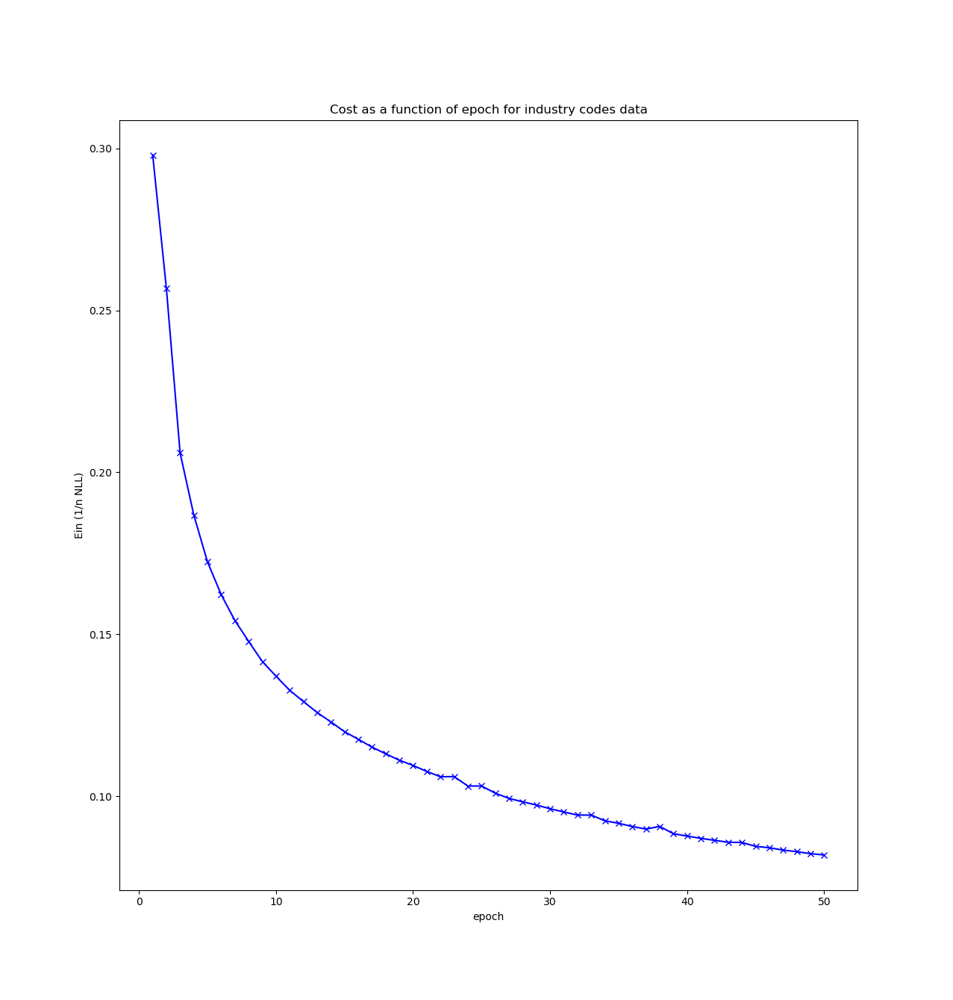
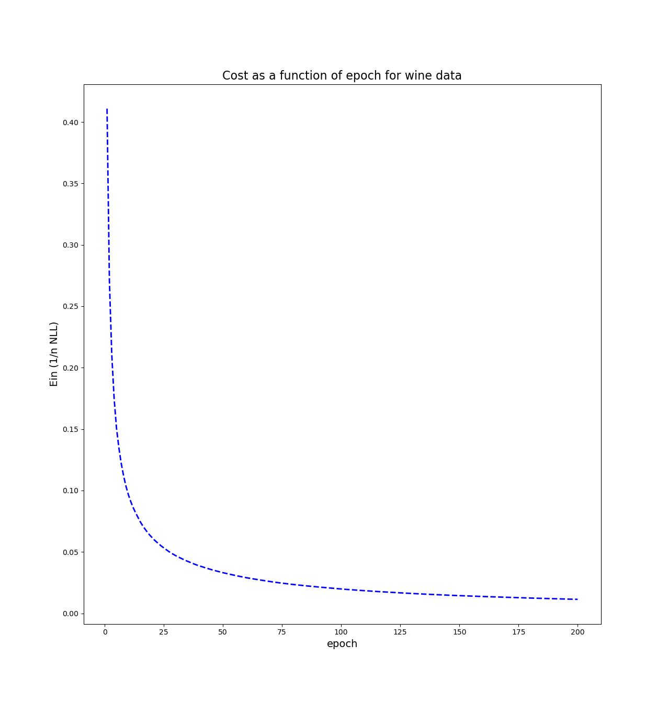
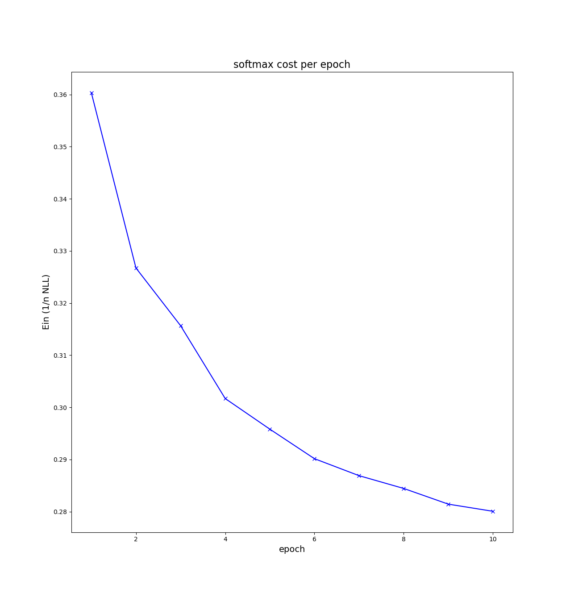
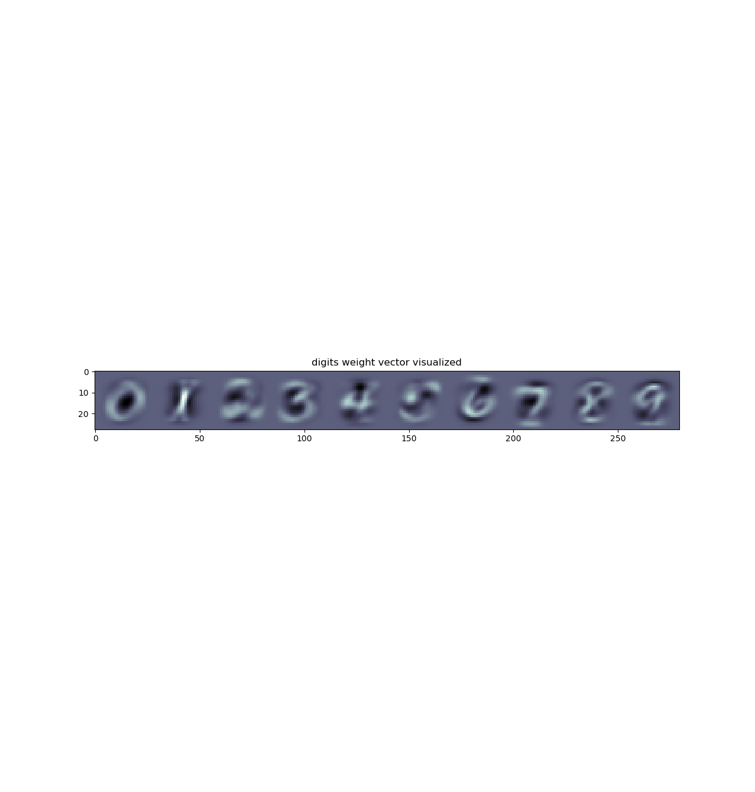

# Handin 1

| Name                 | Student ID |
| -------------------- | ---------- |
| Daniel Naddaf        | 202106189  |
| Behzad Haidari       | 202006894  |
| Peter Ernst Lüdeking | 202307043  |

## PART I: Logistic Regression

### Code

#### Summary and Results

- **In-sample accuracy:** 0.9763
- **Test accuracy:** 0.9623

**Generated Plot:**  


The plot demonstrates a clear decrease in the in-sample negative log likelihood cost over the training epochs, indicating effective model learning.

All tests passed successfully.

#### Actual Code

```python
# cost_grad
def cost_grad(self, X, y, w):
    cost = 0
    grad = np.zeros(w.shape)
    cost = np.mean(np.log(1 + np.exp(-y * (X @ w))))
    grad = -np.mean((y * logistic(-y * (X @ w)))[:, np.newaxis] * X, axis=0)
    assert grad.shape == w.shape
    return cost, grad

# fit
def fit(self, X, y, w=None, lr=0.1, batch_size=16, epochs=10):
    if w is None: w = np.zeros(X.shape[1])
    history = []
    for _ in range(epochs):
        perm = np.random.permutation(X.shape[0])
        X_shuffled = X[perm]
        y_shuffled = y[perm]
        for i in range(0, X.shape[0], batch_size):
            X_batch = X_shuffled[i:i+batch_size]
            y_batch = y_shuffled[i:i+batch_size]
            cost, grad = self.cost_grad(X_batch, y_batch, w)
            w -= lr * grad
        history.append(self.cost_grad(X, y, w)[0])
    self.w = w
    self.history = history
```

### Theory

#### Q1. Running Time of Mini-Batch Gradient Descent

To analyze the running time of the `fit` method, we break it down into its components:

- **n:** Number of training samples
- **d:** Number of features
- **E:** Number of epochs
- **B:** Batch size

**Breakdown:**

- Create d-array: O(d)
- Epoch loop: O(E)
  - Permutation: O(n)
  - Shuffle X: O(nd)
  - Shuffle y: O(n)
  - Batch loop: O(n/B)
    - X batch: O(Bd)
    - y batch: O(B)
    - cost_grad: O(nd + n + d)
    - Weight update: O(1)
  - Append result: O(cost_grad)

**Total running time:**

After simplification, the overall time complexity is:

```
O(E * n * d)
```

#### Q2. Sanity Check (Cats vs. Dogs)

If we apply the same fixed permutation to all the images, it reorders the feature indices for every element. If we also use the same reordering for the weights to correspond to the features, then the decision function is mathematically unchanged, given it is the same permutation at test. The performance will therefore be the same.
Mathematically, we can let P denote a random permutation matrix. Then we have $$ (Pw)^T (Px) = w^T(P^TP)x = w^Tx $$ since $P^TP = I$.

#### Q3. Linearly Separable Data

Given the data is linearly separable and logistic regression is implemented with gradient descent, then every time gradient descent is run, it will reduce the loss. In other words:
$$ log(1+e^{(-c\cdot \text{a positive number})}) \rightarrow 0 $$ when $$ c \rightarrow \infty $$
in other words, by letting $||w||$ converge to $\infty$ then we can minimize the loss as much as possible. There is therefor no finite w that minimizes. Infimum is 0, but achieved when the limit $||w|| \rightarrow 0 $

## PART II: Softmax Regression

### Code

#### Summary and Results

- **Wine data set – In-sample accuracy:** 1.0
- **Wine data set – Test accuracy:** 0.978
- **MNIST data set – In-sample accuracy:** 0.9218
- **MNIST data set – Test accuracy:** 0.9216

**Generated Plots:**  
  
  


The cost plots for both wine and MNIST datasets show a rapid decrease in the negative log likelihood during early epochs, indicating successful learning. The MNIST weight visualization clearly shows distinct patterns resembling each digit, demonstrating the classifier's ability to differentiate them.

#### Actual Code

```python
# cost_grad
def cost_grad(self, X, y, W):
    cost = np.nan
    grad = np.zeros(W.shape)*np.nan
    Yk = one_in_k_encoding(y, self.num_classes)
    softmax_probs = softmax(X @ W)
    correct_class_probs = softmax_probs[np.arange(X.shape[0]), y]
    cost = -np.mean(np.log(correct_class_probs))
    grad = X.T @ (softmax_probs - Yk) / X.shape[0]
    return cost, grad

# fit
def fit(self, X, Y, W=None, lr=0.01, epochs=10, batch_size=16):
    if W is None: W = np.zeros((X.shape, self.num_classes))
    history = []
    for _ in range(epochs):
        perm = np.random.permutation(X.shape[0])
        X_shuffled = X[perm]
        y_shuffled = Y[perm]
        for i in range(0, X.shape[0], batch_size):
            X_batch = X_shuffled[i:i+batch_size]
            y_batch = y_shuffled[i:i+batch_size]
            cost, grad = self.cost_grad(X_batch, y_batch, W)
            W -= lr * grad
        history.append(self.cost_grad(X, Y, W)[0])
    self.W = W
    self.history = history
```

### Theory

#### Q1. Running Time of Softmax Implementation

Let:

- **n:** Number of training samples
- **d:** Number of features
- **k:** Number of classes

**Breakdown:**

- One-in-k encoding: O(nk)
- Softmax: O(nd)
- np.arange: O(n)
- np.mean: O(n)
- Gradient calculation: O(dnk)

**Total running time:**

After simplification, the time complexity for `cost_grad` is:

```
O(dnk)
```
